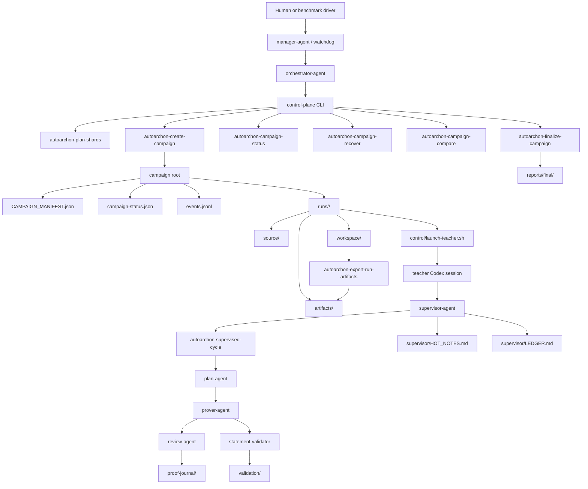

# AutoArchon

AutoArchon is a Codex-first Lean 4 proving system for repository-scale formalization and benchmark execution. It keeps the original `plan -> prover -> review` loop, then adds an outer control plane for isolated runs, teacher supervision, deterministic recovery, campaign orchestration, and accepted proof export.

## What AutoArchon Adds

- Codex CLI replaces the original Claude-only runtime across setup, init, loop, review, and prompts.
- Lean 4.28.0 is pinned to match the FATE benchmark toolchain.
- `supervisor-agent` hardens theorem fidelity, acceptance, lessons, and restart behavior for long runs.
- `orchestrator-agent` owns multi-run campaigns, teacher launch, monitoring, recovery, and final reports.
- `manager-agent` is a proposed layer above orchestrator/watchdog for long unattended benchmark ownership.
- Accepted outputs are separated from mutable workspaces so a mathematician can inspect final proofs without reading live state.

## System Map



## Repository Layout

```text
AutoArchon/
├── archon-loop.sh
├── archonlib/
├── agents/
├── docs/
├── scripts/
├── skills/archon-orchestrator/
├── skills/archon-supervisor/
├── tests/
└── ui/
```

Key directories:

- `archonlib/`: control-plane and runtime Python library code.
- `scripts/`: operator entrypoints for runs, campaigns, recovery, compare reports, exports, and watchdogs.
- `agents/`: explicit runtime and proposed agent registry.
- `skills/`: repo-owned Codex skills for supervisor and orchestrator roles.
- `docs/`: architecture, benchmarking, orchestration, operations, manager/watchdog, and teacher handoff docs.
- `tests/`: runtime, supervisor, campaign, registry, and docs-contract coverage.

## Install

```bash
git clone <your-public-fork-url>
cd AutoArchon
./setup.sh
bash scripts/install_repo_skill.sh
```

`setup.sh` verifies or installs:

- `git`
- `python3`
- `uv`
- `elan`, `lean`, `lake`
- `codex`

It also runs `uv sync --all-groups` so the repo-owned CLI entrypoints are ready for `uv run`.

Launch a fresh Codex session after installing repo-owned skills so `$archon-supervisor` and `$archon-orchestrator` are available.

## Fastest Campaign Start

Use this path when you want the full modern system: isolated runs, teacher supervision, recovery, and accepted final reports.

1. Start a fresh interactive owner session:

```bash
codex -C /path/to/AutoArchon \
  --model gpt-5.4 \
  --sandbox danger-full-access \
  --ask-for-approval never \
  -c model_reasoning_effort=xhigh
```

2. Use this as the first message:

```text
Use $archon-orchestrator to own this AutoArchon campaign.

Repository root: /path/to/AutoArchon
Source root: /path/to/FATE-M
Campaign root: /path/to/campaigns/fate-m-nightly
Reuse lake from: /path/to/warmed-project
Match regex: '^FATEM/(39|42|43)\\.lean$'
Shard size: 1
Run id mode: file_stem

Mission:
- if the campaign root does not exist yet, bootstrap it yourself with `uv run --directory /path/to/AutoArchon autoarchon-plan-shards` and `uv run --directory /path/to/AutoArchon autoarchon-create-campaign`
- if the campaign root already exists, treat it as exclusive scope and do not regenerate run specs unless the user changes scope
- keep teachers on disjoint run roots
- prefer deterministic recovery via `uv run --directory /path/to/AutoArchon autoarchon-campaign-recover` over ad hoc shell logic
- finalize only validated proofs and accepted blocker notes into reports/final/

Stop only when:
- all runs are in terminal states and reports/final/ is up to date, or
- a hard external dependency prevents safe continuation
```

3. From another shell, inspect or steer the campaign with the control-plane CLI:

```bash
uv run --directory /path/to/AutoArchon autoarchon-campaign-status --campaign-root /path/to/campaigns/fate-m-nightly
uv run --directory /path/to/AutoArchon autoarchon-campaign-recover --campaign-root /path/to/campaigns/fate-m-nightly --all-recoverable --execute
uv run --directory /path/to/AutoArchon autoarchon-campaign-compare --campaign-root /path/to/campaigns/fate-m-nightly
uv run --directory /path/to/AutoArchon autoarchon-finalize-campaign --campaign-root /path/to/campaigns/fate-m-nightly
```

`control-plane commands` are local terminal commands for campaign state, recovery, compare reports, and final export. They are not the web UI. For the live dashboard, use `bash ui/start.sh --project /path/to/run-root/workspace`.

Fresh queued campaigns can be launched safely with `autoarchon-campaign-recover --all-recoverable --execute`. Detached launch writes `teacher-launch-state.json` before the teacher reaches `run-lease.json`, so a second owner or recovery pass will see the run as in-flight instead of launching a duplicate teacher on the same workspace.

## Manager And Watchdog

If you want one higher-level owner session that monitors orchestrator health and restarts it on stalls, use [docs/manager-watchdog.md](docs/manager-watchdog.md).

Typical unattended entrypoint:

```bash
uv run --directory /path/to/AutoArchon autoarchon-orchestrator-watchdog \
  --campaign-root /path/to/campaigns/fate-m-nightly
```

## Take Over Interrupted Campaign

Use this when the campaign root already exists but the previous owner session or network path died.

1. Recompute truth first:

```bash
uv run --directory /path/to/AutoArchon autoarchon-campaign-status --campaign-root /path/to/campaign-root
```

2. Start a fresh owner session:

```bash
codex -C /path/to/AutoArchon \
  --model gpt-5.4 \
  --sandbox danger-full-access \
  --ask-for-approval never \
  -c model_reasoning_effort=xhigh
```

3. Use this as the first message:

```text
Use $archon-orchestrator to own this existing AutoArchon campaign.

Repository root: /path/to/AutoArchon
Campaign root: /path/to/campaign-root

Mission:
- treat this campaign root as exclusive scope
- recompute campaign-status.json before acting
- do not inspect unrelated sibling campaigns just to choose naming or workflow patterns
- apply recommendedRecovery deterministically before inventing custom shell logic
- finalize only validated proofs and accepted blocker notes into reports/final/

Stop only when:
- all runs are in terminal states and reports/final/ is current, or
- a hard external dependency prevents safe continuation
```

## Where Proofs End Up

The source of truth is always the isolated run, not the dashboard and not the planner notes.

- Final generated proofs live in `run-root/workspace/`.
- Immutable originals live in `run-root/source/`.
- Exported review bundles live in `run-root/artifacts/`.
- Campaign-level accepted bundles live in `campaign-root/reports/final/`.
- Prover and supervisor logs live under `.archon/logs/iter-*`.
- Per-file durable notes live under `.archon/task_results/`.
- Review summaries live under `.archon/proof-journal/`.
- Validation verdicts live under `.archon/validation/`.
- Lessons and recovery summaries live under `.archon/lessons/`.
- Teacher heartbeat and supervision notes live under `.archon/supervisor/`, including `run-lease.json`, `HOT_NOTES.md`, and `LEDGER.md`.

Example review surfaces:

- `runs/<run>/workspace/FATEM/39.lean`
- `runs/<run>/artifacts/proofs/FATEM/39.lean`
- `campaigns/<campaign>/reports/final/proofs/<run>/FATEM/39.lean`
- `campaigns/<campaign>/reports/final/blockers/<run>/`

To inspect a live run in the UI:

```bash
bash ui/start.sh --project /path/to/run-root/workspace
```

## Lower-Level Modes

Most users should start with campaign orchestration. Lower-level entrypoints still exist, but they are intentionally secondary:

- Single isolated run with one supervisor: see [docs/operations.md](docs/operations.md).
- Parallel teachers without a top-level owner: see [docs/teacher-agents.md](docs/teacher-agents.md).
- Manual campaign creation and operator CLI: see [docs/orchestrator.md](docs/orchestrator.md).
- Manager/watchdog ownership and ablation protocol: see [docs/manager-watchdog.md](docs/manager-watchdog.md).
- Direct project loop usage: `./init.sh /path/to/project`, then `./archon-loop.sh /path/to/project`, then `./review.sh /path/to/project`.

## Quick Supervisor Soak Test

Use this only when you want one teacher over one isolated run without the outer campaign owner.

```bash
codex exec \
  --skip-git-repo-check \
  --sandbox danger-full-access \
  -c approval_policy=never \
  -c model_reasoning_effort=xhigh \
  --model gpt-5.4 \
  - <<'EOF'
Use $archon-supervisor to supervise this AutoArchon run.

Repository root: /path/to/AutoArchon
Run root: /path/to/run-root
Source root: /path/to/run-root/source
Workspace root: /path/to/run-root/workspace

Mission:
- keep theorem headers faithful to source
- supervise repeated plan/prover cycles until the scoped objectives are solved, a blocker is validated, or an external stop condition is hit
- prefer `uv run --directory /path/to/AutoArchon autoarchon-supervised-cycle --workspace /path/to/run-root/workspace --source /path/to/run-root/source --plan-timeout-seconds 180 --prover-timeout-seconds 240 --prover-idle-seconds 90 --no-review`
- export milestone artifacts with `uv run --directory /path/to/AutoArchon autoarchon-export-run-artifacts --run-root /path/to/run-root`
- do not stop to give an interim report; keep writing progress into workspace/.archon/supervisor/HOT_NOTES.md and workspace/.archon/supervisor/LEDGER.md instead
EOF
```

## Further Reading

- [docs/architecture.md](docs/architecture.md): global workflow, contracts, and observability.
- [docs/benchmarking.md](docs/benchmarking.md): benchmark-faithful vs contaminated runs and benchmark caveats.
- [docs/agent-registry.md](docs/agent-registry.md): runtime and proposed agent contracts.
- [docs/orchestrator.md](docs/orchestrator.md): orchestrator-first control plane, campaign creation, launch, monitoring, recovery, and finalization.
- [docs/manager-watchdog.md](docs/manager-watchdog.md): higher-level owner role, watchdog policy, and ablation protocol.
- [docs/teacher-agents.md](docs/teacher-agents.md): direct teacher prompts and multi-teacher operator handoff.
- [docs/operations.md](docs/operations.md): single-run operational baseline.
- [docs/roadmaps/control-plane-phase3.md](docs/roadmaps/control-plane-phase3.md): saved control-plane implementation roadmap.
