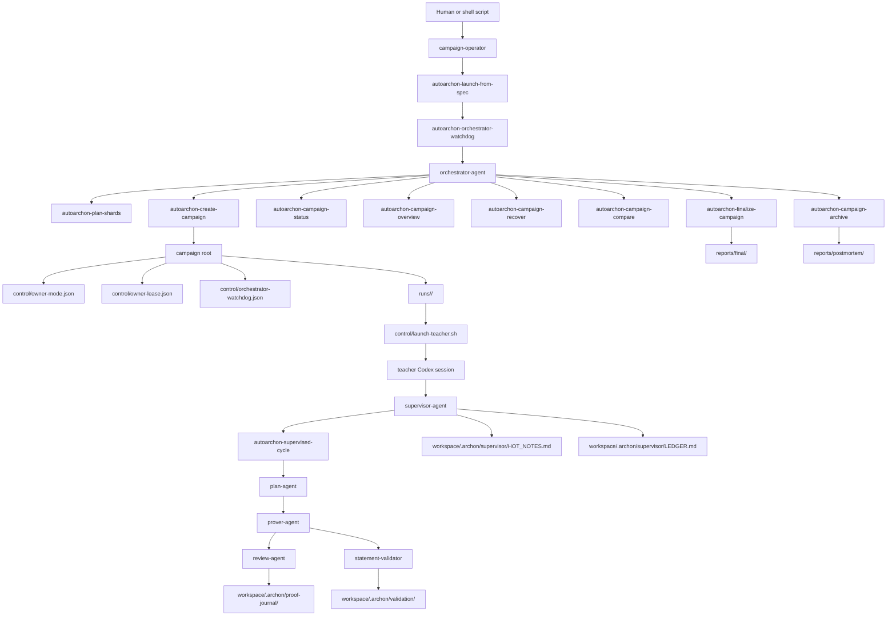

# AutoArchon

AutoArchon is a Codex-first Lean 4 proving system for long-running formalization and benchmark campaigns. It keeps the original `plan -> prover -> review` loop, then adds an outer control plane for isolated runs, teacher launch, watchdog recovery, final proof export, and postmortem archiving.

## Default Path

The default outer role is `campaign-operator`, not `manager-agent`.

- `campaign-operator` turns a benchmark intent into a launch spec, campaign root, watchdog process, overview snapshots, and postmortem archives.
- `orchestrator-agent` owns one campaign root at a time.
- `watchdog` is the mechanical reliability wrapper around the orchestrator.
- `supervisor-agent` owns one run root at a time and guards theorem fidelity.
- `manager-agent` remains a future, optional layer for multi-campaign policy only.

## System Map



## Install

```bash
git clone <your-fork-or-upstream-url>
cd AutoArchon
./setup.sh
uv sync --all-groups
bash scripts/install_repo_skill.sh
```

`setup.sh` verifies `uv`, `elan`, `lean`, `lake`, and `codex`. After installing repo skills, start a fresh Codex session so `$archon-orchestrator` and `$archon-supervisor` are available.

## Fastest Campaign Start

This is the main user path.

1. Prepare benchmarks under a shared root such as `/path/to/benchmarks/FATE-M-upstream`, `/path/to/benchmarks/FATE-H-upstream`, and `/path/to/benchmarks/FATE-X-upstream`.
2. Launch the bundled three-campaign night run:

```bash
export MODEL=gpt-5.4
export REASONING_EFFORT=xhigh
export BENCHMARK_ROOT=/path/to/benchmarks
export CAMPAIGNS_ROOT=/path/to/runs/campaigns
export RUN_SPECS_ROOT=/path/to/runs/campaigns/_run_specs
export FATE_DATE_TAG=$(date +%Y%m%d-nightly)

bash scripts/start_fate_overnight_watchdogs.sh
```

That script calls `autoarchon-launch-from-spec` for the three tracked templates in `campaign_specs/` and then starts one watchdog per campaign. Use `DRY_RUN=1 bash scripts/start_fate_overnight_watchdogs.sh` to inspect the resolved commands without mutating campaign state or spec templates.

3. Watch progress from another shell:

```bash
bash scripts/collect_fate_campaign_summaries.sh

uv run --directory /path/to/AutoArchon autoarchon-campaign-overview \
  --campaign-root /path/to/runs/campaigns/20260413-nightly-fate-m-full \
  --markdown
```

`control-plane commands` are terminal commands for machine-readable state. They are not the web UI. The optional web UI remains useful for deep inspection of a single run:

```bash
bash ui/start.sh --project /path/to/run-root/workspace
```

## Single Campaign From Spec

If you only want one campaign, launch it directly from a spec:

```bash
export MODEL=gpt-5.4
export REASONING_EFFORT=xhigh
export BENCHMARK_ROOT=/path/to/benchmarks
export CAMPAIGNS_ROOT=/path/to/runs/campaigns
export RUN_SPECS_ROOT=/path/to/runs/campaigns/_run_specs
export FATE_DATE_TAG=20260413-nightly

uv run --directory /path/to/AutoArchon autoarchon-launch-from-spec \
  --spec-file /path/to/AutoArchon/campaign_specs/fate-m-full.json
```

Useful companion commands:

```bash
uv run --directory /path/to/AutoArchon autoarchon-campaign-status --campaign-root /path/to/campaign-root
uv run --directory /path/to/AutoArchon autoarchon-campaign-recover --campaign-root /path/to/campaign-root --run-id teacher-m-001 --execute
uv run --directory /path/to/AutoArchon autoarchon-campaign-compare --campaign-root /path/to/campaign-root
uv run --directory /path/to/AutoArchon autoarchon-campaign-archive --campaign-root /path/to/campaign-root
uv run --directory /path/to/AutoArchon autoarchon-finalize-campaign --campaign-root /path/to/campaign-root
```

The spec-driven path writes `control/launch-spec.resolved.json`, keeps `owner-mode.json` in sync, and starts the watchdog with bounded recovery settings. `control/owner-lease.json`, `control/orchestrator-watchdog.json`, `reports/final/compare-report.json`, and `reports/postmortem/postmortem-summary.json` are the main outer-loop surfaces.

## Interactive Owner Session

If you want Codex itself to act as the outer owner, start an interactive session and then hand it to `$archon-orchestrator`:

```bash
codex -C /path/to/AutoArchon \
  --model gpt-5.4 \
  --sandbox danger-full-access \
  --ask-for-approval never \
  -c model_reasoning_effort=xhigh
```

The detailed prompt template and operator workflow live in [docs/orchestrator.md](docs/orchestrator.md). Use this path when you want a human-steered owner session rather than “just run the script”.

## Quick Supervisor Soak Test

For one isolated run without the full campaign layer, go straight to `$archon-supervisor` and the single-run playbook in [docs/operations.md](docs/operations.md).

Core inner-loop command:

```bash
uv run --directory /path/to/AutoArchon autoarchon-supervised-cycle \
  --workspace /path/to/run-root/workspace \
  --source /path/to/run-root/source \
  --plan-timeout-seconds 180 \
  --prover-timeout-seconds 240 \
  --prover-idle-seconds 90 \
  --no-review
```

## Where Proofs End Up

- Mutable proof search happens only under `runs/<id>/workspace/`.
- A single-run shorthand for that mutable tree is `run-root/workspace/`.
- Immutable originals stay under `runs/<id>/source/`.
- Per-run exported bundles live under `runs/<id>/artifacts/`.
- Campaign-level accepted outputs live under `reports/final/`.
- Archived failed or interrupted night runs live under `reports/postmortem/`.

Concrete final export paths:

- `reports/final/proofs/<run>/`
- `reports/final/blockers/<run>/`
- `reports/final/validation/<run>/`
- `reports/final/runs/<run>/run-summary.json`

The most useful files when auditing a run are:

- `runs/<id>/control/bootstrap-state.json`
- `runs/<id>/control/teacher-launch-state.json`
- `runs/<id>/control/prewarm.stdout.log`
- `runs/<id>/workspace/.archon/task_results/*.md`
- `runs/<id>/workspace/.archon/validation/*.json`
- `runs/<id>/workspace/.archon/logs/iter-*/`
- `runs/<id>/workspace/.archon/proof-journal/`
- `runs/<id>/workspace/.archon/supervisor/run-lease.json`
- `reports/final/compare-report.json`
- `reports/final/runs/<run>/timeline.json`

For mathematician review, prefer exported proofs and validation-backed artifacts under `artifacts/` or `reports/final/`, not the live workspace alone.

## Repository Layout

```text
AutoArchon/
├── agents/
├── archonlib/
├── campaign_specs/
├── docs/
├── scripts/
├── skills/
├── tests/
└── ui/
```

- `agents/`: explicit runtime and proposed agent contracts.
- `archonlib/`: control-plane and runtime library code.
- `campaign_specs/`: tracked benchmark launch templates.
- `scripts/`: public `uv run` entrypoints and operator shell wrappers.
- `skills/`: repo-owned Codex skills for outer-owner and teacher sessions.
- `docs/`: architecture, operations, orchestrator, teacher, and control-plane notes.
- `tests/`: runtime, CLI, watchdog, docs-contract, and registry coverage.

## Docs

- [docs/architecture.md](docs/architecture.md): global workflow, artifact boundaries, observability, future extension points.
- [docs/orchestrator.md](docs/orchestrator.md): interactive owner-session workflow and deterministic recovery CLI.
- [docs/manager-watchdog.md](docs/manager-watchdog.md): `campaign-operator`, watchdog, owner lease, overview, and postmortem surfaces.
- [docs/teacher-agents.md](docs/teacher-agents.md): one-run-per-teacher launch and monitoring.
- [docs/operations.md](docs/operations.md): single-run operational baseline, prewarm, soak-test commands.
- [docs/agent-registry.md](docs/agent-registry.md): runtime agent contracts and future roles.
- [docs/benchmarking.md](docs/benchmarking.md): benchmark-faithful vs contaminated run policy.
- [docs/roadmaps/control-plane-phase4.md](docs/roadmaps/control-plane-phase4.md): current hardening roadmap and remaining gaps.
- [docs/postmortem-20260413-nightly.md](docs/postmortem-20260413-nightly.md): archived summary of the first three nightly FATE samples and why fresh reruns must use new campaign roots.
