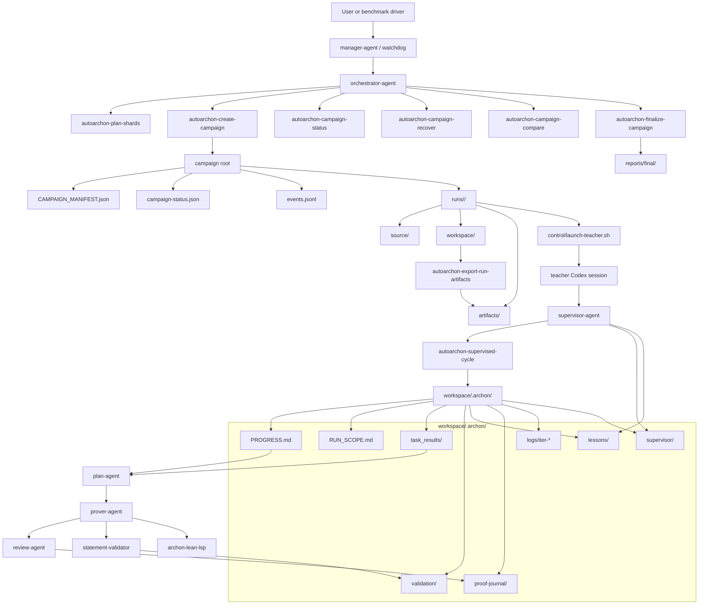

# Architecture

This document is the system-level map for AutoArchon. It describes the active control plane, the single-run proving loop, the artifact boundaries, and the observability fields that matter when you scale campaigns up.

## Global Workflow

## Role Split

- `manager-agent` is the proposed long-horizon owner above one or more campaigns. It chooses watchdog policy, restart budgets, and human-facing summaries.
- `orchestrator-agent` owns campaign creation, teacher deployment, recovery decisions, compare reports, and final accepted exports. It does not directly edit benchmark `.lean` files.
- `supervisor-agent` owns one run root at a time, guards theorem fidelity, runs monitored cycles, and leaves restart-safe notes in `workspace/.archon/supervisor/`.
- `plan-agent` scopes the next step from `workspace/.archon/PROGRESS.md`, `workspace/.archon/RUN_SCOPE.md`, and durable `task_results/`.
- `prover-agent` edits the scoped Lean file and emits theorem-level results.
- `review-agent` summarizes iterations into `proof-journal/`.
- `statement-validator` writes deterministic theorem-fidelity verdicts and acceptance metadata.

## Artifact Boundaries

- `source/` is immutable comparison baseline.
- `workspace/` is the only place where proof search edits happen.
- `artifacts/` is the per-run export surface for mathematician review.
- `reports/final/` is the campaign-level accepted surface. Only accepted proofs, accepted blocker notes, copied validation verdicts, lessons, and supervisor summaries belong there.

This split is what makes benchmark-faithful evaluation possible. A live workspace can be useful while still being unaccepted.

## State Contract

The proving loop is intentionally file-coupled. The most important runtime files are:

- `workspace/.archon/PROGRESS.md`: current stage and current objectives.
- `workspace/.archon/RUN_SCOPE.md`: hard file boundary for plan/prover work.
- `workspace/.archon/task_results/`: durable per-file results, blocker notes, and handoff notes.
- `workspace/.archon/validation/`: machine-readable theorem-fidelity and acceptance status.
- `workspace/.archon/lessons/`: cycle summaries and recovery lessons.
- `workspace/.archon/supervisor/run-lease.json`: authoritative teacher heartbeat and ownership.
- `workspace/.archon/supervisor/HOT_NOTES.md`: short restart summary.
- `workspace/.archon/supervisor/LEDGER.md`: longer chronology.
- `workspace/.archon/logs/iter-*`: plan/prover/review logs and iteration metadata.

## Observability

The observability model is designed for long campaigns where runs can die, restart, or be handed off to a fresh owner session.

Campaign-level signals:

- `campaign-status.json`: run status, `recommendedRecovery`, heartbeat age, accepted proofs, accepted blockers, and pending targets.
- `events.jsonl`: append-only chronology of control-plane actions.
- `reports/final/compare-report.json` and `reports/final/final-summary.json`: compact benchmark-facing summaries.
- `control/teacher-launch-state.json`: pre-lease in-flight marker for detached launches.
- `control/orchestrator-watchdog.json`: owner session status, `sessionId`, `restartCount`, `stallSeconds`, and the last watchdog fingerprint.

Run-level signals:

- `workspace/.archon/supervisor/run-lease.json`: live ownership, heartbeat, and loop pid.
- `workspace/.archon/supervisor/violations.jsonl`: idle timeout, theorem mutation, copied-state contamination, and other policy events.
- `workspace/.archon/logs/iter-*/meta.json`: stage status and timing such as `durationSecs`.
- prover and review JSONL logs: token and step accounting, including fields such as `input_tokens` and `output_tokens` when the backend emits them.

These are the fields the outer owner should trust before it decides to relaunch, recover-only, quarantine, or finalize.

## Extension Points

The high-ROI extension points are still around validation and control, not around adding many autonomous agents at once.

- Better statement preflight before proof search.
- Richer acceptance and audit agents downstream of `statement-validator`.
- A stable manager/watchdog contract above the current orchestrator.
- Tighter prover orchestration over `archon-lean-lsp` and deterministic recovery commands.

The current bias is intentional: stabilize the outer loop, keep the file contracts explicit, and only then add more permanent agents.
