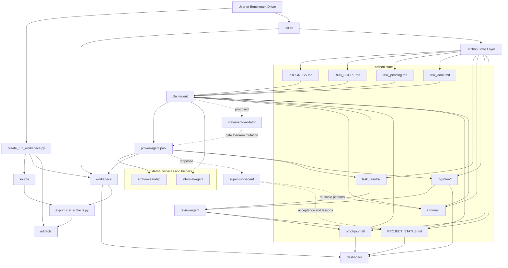

# Architecture

This document is the system-level map for the Codex fork of Archon. It covers the active runtime, the `.archon/` state contract, and the extension points with the best current ROI.

## Global Workflow

## Active Runtime

The current production path is still intentionally narrow:

- `plan-agent` reads scoped project state, merges fresh `task_results`, and writes the next objectives plus shared informal notes.
- `prover-agent` owns Lean source edits within its assigned file and emits file-scoped result reports.
- `review-agent` is read-only over source and produces cross-iteration summaries in `proof-journal/` and `PROJECT_STATUS.md`.
- `informal-agent` is an auxiliary helper for proof sketches and external reasoning, not a scheduler.

The vendored Lean4 materials under `.archon-src/skills/lean4/` are support assets and references. They are not the core Archon scheduler and should not be treated as the authoritative runtime contract.

## State Contract

The runtime is coupled through files on purpose. The most important public contract is the `.archon/` directory:

- `.archon/PROGRESS.md` and `.archon/RUN_SCOPE.md` define the live stage and the hard file boundary.
- `.archon/task_pending.md`, `.archon/task_done.md`, and `.archon/task_results/` are the task handoff surface between agents.
- `.archon/informal/` is the shared memory layer for proof routes that should persist across iterations.
- `.archon/logs/iter-*` is the observability layer for plan, prover, and snapshot replay.
- `.archon/proof-journal/` and `.archon/PROJECT_STATUS.md` are the review layer.
- `.archon/supervisor/` is the restart and policy layer for long-running supervised sessions.

Final proofs are authored in the workspace `.lean` files. For external review, `export_run_artifacts.py` copies trustworthy changed files and diffs into `run-root/artifacts/`.

## Isolated Run Layout

For benchmark-faithful work, prefer a three-root run:

- `source/`: immutable comparison baseline
- `workspace/`: mutable Lean project edited by Archon
- `artifacts/`: exported proofs, diffs, task-result notes, and supervisor notes

The dashboard still points at `workspace/.archon/`. It does not replace the source/artifact boundary.

## Observability

These fields should remain aligned across logs, docs, and future registry entries:

- `iteration`
- `agent`
- `target file`
- `status`
- `durationSecs`
- `input_tokens`
- `output_tokens`
- `mutation class`
- `verification status`
- `blocker type`

The dashboard reads these from `.archon/logs`, `.archon/proof-journal/`, and the run worktree. It does not infer hidden state.

## Decoupling Assessment

A full plugin-style scheduler is not the best next move. The current highest-value work is:

1. Keep the core runtime stable and benchmark-faithful.
2. Make artifacts easier to inspect and compare.
3. Document each agent and handoff as an explicit contract.

That is why this fork now treats `docs/agents/*.json` as the lightweight registry layer. The registry is documentation and test surface first. Runtime integration should come only after an agent proves its ROI on real benchmark bottlenecks.

## Best Next Extensions

The next two additions with the best cost/performance ratio are:

- `statement-validator`: runs before or beside the prover to detect forbidden theorem-header mutation, benchmark statement drift, or obvious false-statement signals.
- `supervisor-agent`: performs independent acceptance, summarizes failures, and writes reusable lessons back into `PROJECT_STATUS.md` or `.archon/informal/`.

Both are intentionally documented now, but not yet made mandatory runtime stages.
