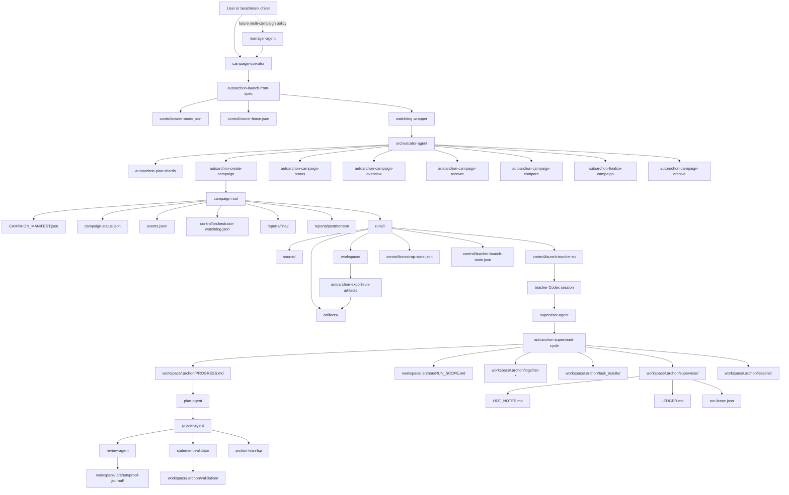

# Architecture

This is the system-level map for AutoArchon after the control-plane hardening pass. The default outer path is now `campaign-operator -> launch-from-spec -> watchdog -> orchestrator-agent -> supervisor-agent`.

## Global Workflow

## Role Split

- `campaign-operator` is the default outer owner. It chooses a spec, launches or resumes a campaign, reads `autoarchon-campaign-overview`, and decides whether to archive or rerun.
- `watchdog` is the concrete reliability wrapper. It owns restart budget, owner lease refresh, owner conflict handling, stale-launch cleanup, and `reportFreshness`.
- `orchestrator-agent` owns one campaign root at a time. It plans shards, creates runs, launches teachers, applies bounded deterministic recovery, and finalizes accepted results. It does not directly edit benchmark `.lean` files.
- `supervisor-agent` owns one run root at a time, guards theorem fidelity, leaves restart-safe notes, and drives repeated monitored cycles.
- `plan-agent`, `prover-agent`, `review-agent`, and `statement-validator` remain the inner proof loop.
- `manager-agent` stays optional and future-facing. Use it only when you truly need multi-campaign policy or human-facing rollups above multiple operators.

## Artifact Boundaries

- `source/` is immutable baseline.
- `workspace/` is the only mutable proof-search area.
- `artifacts/` is the per-run export bundle for mathematician review.
- `reports/final/` is the campaign-level accepted surface.
- `reports/postmortem/` is the archived diagnostic surface for stopped, degraded, or intentionally non-final benchmark samples.

The system is designed so a run may have useful live workspace state without being counted as accepted.

## State Contract

The most important operator-facing files are:

- `campaign-status.json`: run status, `recommendedRecovery`, accepted proofs, accepted blockers, and pending targets
- `control/owner-mode.json`: declared owner mode for the campaign
- `control/owner-lease.json`: outer-owner lease, session identity, and conflict guard
- `control/launch-spec.resolved.json`: the resolved spec used by the campaign-operator
- `control/orchestrator-watchdog.json`: `watchdogStatus`, `restartCount`, `stallReason`, `runCounts`, `activeLaunches`, `reportFreshness`, and progress timestamps
- key watchdog JSON fields also include `ownerLease`
- `runs/<id>/control/bootstrap-state.json`: fresh-run summary, `prewarmRequired`, and `allowedFiles`
- `runs/<id>/control/teacher-launch-state.json`: detached launch phase before `run-lease.json` is live
- `runs/<id>/RUN_MANIFEST.json`: bootstrap metadata such as `projectBuildReused`
- `workspace/.archon/supervisor/run-lease.json`: authoritative run-local ownership and heartbeat
- `workspace/.archon/supervisor/HOT_NOTES.md` and `LEDGER.md`: restart-safe teacher notes
- `workspace/.archon/logs/iter-*/meta.json`: cycle timing such as `durationSecs`
- prover logs: token accounting such as `input_tokens` and `output_tokens` when available

These are the files the outer owner should trust before relaunching, archiving, or finalizing.

## Observability

Campaign-level observability should answer four questions quickly:

1. Is the campaign making progress?
2. Is the owner healthy?
3. Are duplicate or stale launches being contained?
4. Is the current benchmark sample final, or should it be archived as postmortem only?

The current answers live in:

- `autoarchon-campaign-overview`
- `campaign-status.json`
- `reports/final/compare-report.json`
- `reports/postmortem/postmortem-summary.json`
- `control/orchestrator-watchdog.log`

The dashboard is still useful for one run, but the campaign summary surface is intentionally CLI-first.

## Extension Points

The next profitable extension points are around verification and knowledge accumulation rather than adding many loosely coupled proof agents at once.

- a helper prover contract that can take bounded subgoals without owning final acceptance
- richer acceptance and audit downstream of `statement-validator`
- lessons taxonomy and error clustering for repeated failure modes
- mathlib-specialist or retrieval-style agents driven by accumulated blocker/error logs
- a future `manager-agent` only when multiple campaigns actually need shared policy

The rule stays the same: stabilize the control plane first, then add more agents against explicit file contracts.
